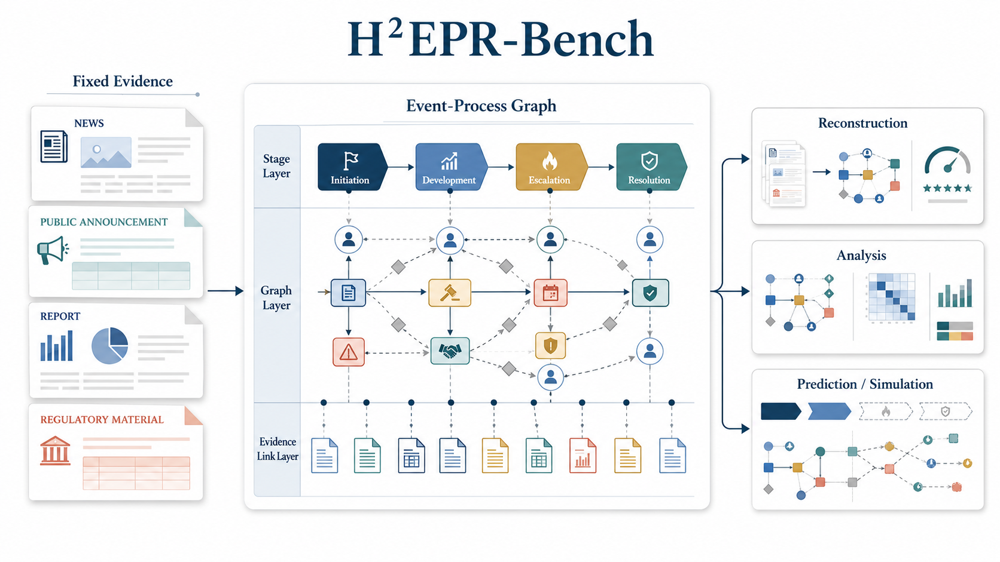

# H²EPR-Bench

[](https://agenticfinlab.github.io/H2EPR-Bench/)
[](https://huggingface.co/datasets/AgenticFinLab/H2EPR-Bench)
[](https://huggingface.co/spaces/AgenticFinLab/H2EPR-Bench-Explorer)
[](https://github.com/AgenticFinLab/FinMycelium)
[](https://huggingface.co/datasets/AgenticFinLab/H2EPR-Bench-Gold)

**An Evidence-Traceable Benchmark for Event-Process Reconstruction**

How well can a model explain not only what happened, but how an event
unfolded? H²EPR-Bench turns that question into a structured reconstruction
task. Given an event specification and fixed multi-source evidence, a system
must recover a hierarchical heterogeneous Event-Process Graph (EPG): ordered
stages, episodes, participants, actions, outcomes, relations, and the evidence
that supports them.

H²EPR-Bench spans 3,000 real-world events across six domains and 26 categories.
Its accompanying study evaluates 21 language models and reveals a persistent
gap between recognizing salient facts and reconstructing the temporal, causal,
and mechanistic structure that connects them.

<p align="center">
  
</p>

## Benchmark at a glance

| | |
|---|---:|
| Real-world events | 3,000 |
| Temporal coverage | 1629–2025 |
| Domains / event categories | 6 / 26 |
| Retrieved source records | 84,693 |
| Verified documents | 25,814 |
| Expert-finalized reference EPGs | 3,000 |
| Models evaluated | 21 |

## From event facts to event processes

An EPG represents an event at three connected levels:

- **Stages** capture the event's macro-level progression.
- **Episodes** organize the developments within each stage.
- **Participants, actions, outcomes, and typed relations** expose the event's
  fine-grained semantics.
- **Evidence-support links** connect graph elements and relations to their
  source material.

This representation preserves the organization that summaries and timelines
often leave implicit. H²EPR-Bench evaluates reconstruction along four
dimensions: **structural**, **temporal**, **causal**, and **evidence** fidelity.

## What the benchmark reveals

Current models are much better at recovering local facts and coarse structure
than the process logic between them. The strongest system reaches an
H²EPRScore of **53.00**. Source attribution and stage ordering exceed **82**
points, while action–outcome, causal, and explicit temporal relations remain
below **19**. Mediated mechanism paths are especially difficult, with only
**9.83%** retained on average.

These results make H²EPR-Bench a diagnostic benchmark for event understanding,
not just another generation leaderboard: it shows where a reconstruction is
faithful and where the event process breaks down.

## Explore H²EPR-Bench

| Resource | What you can do |
|---|---|
| [Project Website](https://agenticfinlab.github.io/H2EPR-Bench/) | Read the benchmark overview, methodology, results, and diagnostics. |
| [Public Dataset](https://huggingface.co/datasets/AgenticFinLab/H2EPR-Bench) | Load the event catalog, stage tables, graph summaries, and 3,000 public Draft EPGs. |
| [Event Explorer](https://huggingface.co/spaces/AgenticFinLab/H2EPR-Bench-Explorer) | Search events, inspect timelines, and open event-level graph artifacts. |
| [FinMycelium System](https://github.com/AgenticFinLab/FinMycelium) | Explore the multi-agent system used to construct Draft EPGs. |
| [Reference EPGs (Gated)](https://huggingface.co/datasets/AgenticFinLab/H2EPR-Bench-Gold) | Request the expert-finalized references used for official scoring. |

The public Dataset includes one sanitized FinMycelium Draft EPG for every
event. Official benchmark scoring uses the expert-finalized reference EPGs in
the gated companion repository.

## Quick start

```python
from datasets import load_dataset

gallery = load_dataset(
    "AgenticFinLab/H2EPR-Bench", "event_gallery", split="benchmark"
)
stages = load_dataset(
    "AgenticFinLab/H2EPR-Bench", "event_stages", split="benchmark"
)
```

The public Dataset provides five tabular views:

| Config | Rows | Purpose |
|---|---:|---|
| `event_gallery` | 3,000 | Lightweight event discovery |
| `event_catalog` | 3,000 | Complete benchmark registry |
| `event_instances` | 3,000 | Metadata and artifact access fields |
| `event_stages` | 8,843 | Ordered Draft-EPG stage rows |
| `finalcascade_summary` | 3,000 | Event-level graph and temporal summaries |

## Repository guide

This repository contains the public project surfaces and release tooling. The
Dataset records themselves are hosted on Hugging Face.

| Path | Contents |
|---|---|
| `index.html`, `assets/`, `data/`, `static/` | Project website and aggregate benchmark visuals |
| `spaces/h2epr_bench_explorer/` | Deployable Event Explorer source |
| `datasets/h2epr_bench/` | Public Dataset card, contract, and validator |
| `datasets/h2epr_bench_gold/` | Reference schema, card source, and synthetic interface tests |
| `scripts/`, `tests/` | Reproducible builds and public-release checks |

For contribution and publication details, see
[`docs/release-process.md`](docs/release-process.md) and
[`docs/repository-identity.md`](docs/repository-identity.md).

## Citation

```bibtex
@misc{h2eprbench2026,
  title  = {H²EPR-Bench: An Evidence-Traceable Benchmark for Event-Process Reconstruction},
  author = {AgenticFinLab},
  year   = {2026},
  note   = {Forthcoming}
}
```

## License

Source code is licensed under Apache License 2.0. Dataset content,
documentation, schemas, and visual assets are licensed under CC BY-NC 4.0.
See [`LICENSES/README.md`](LICENSES/README.md) for the path-level policy.
