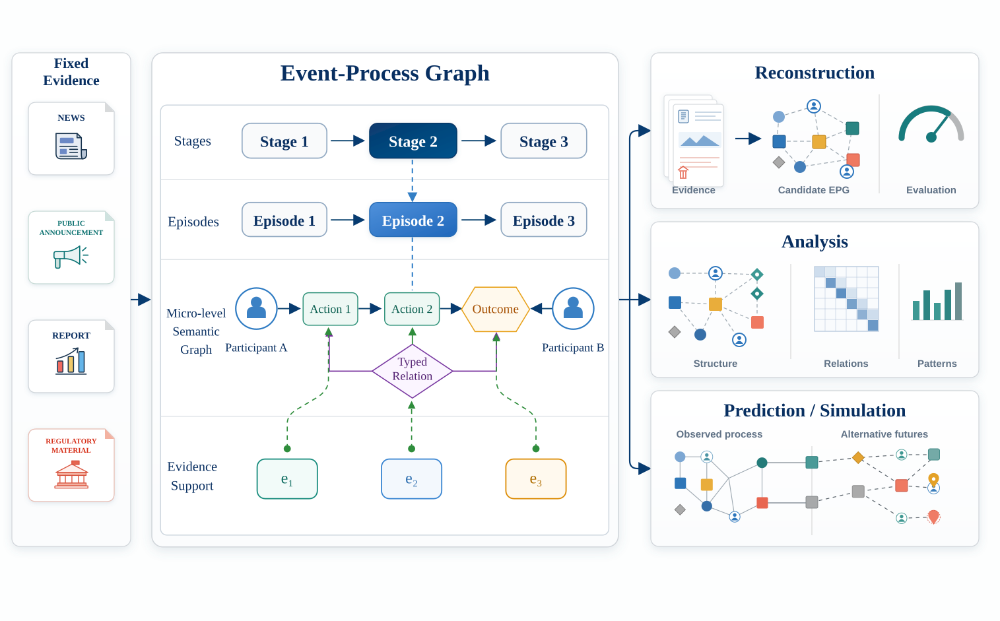
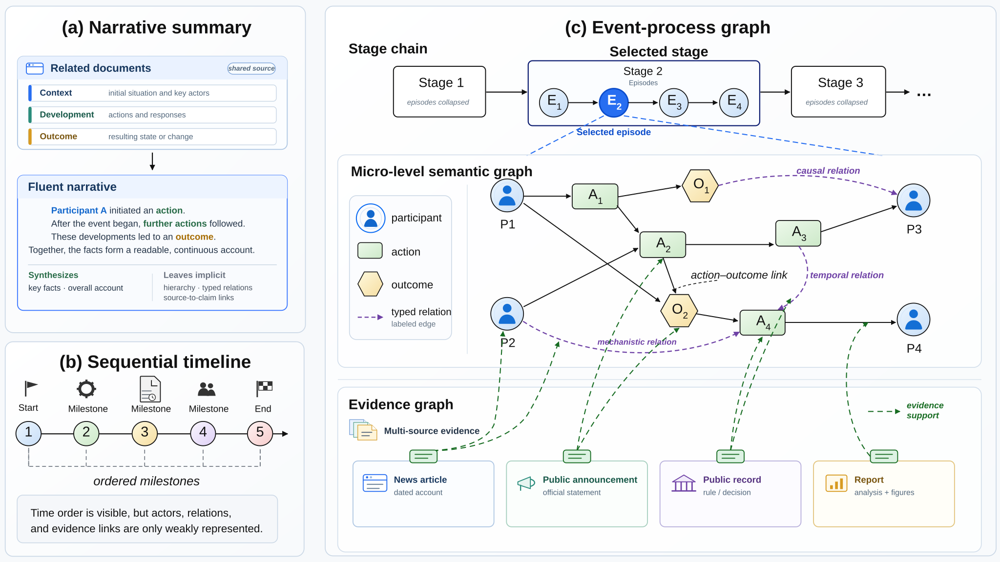

# H²EPR-Bench

**An Evidence-Traceable Benchmark for Event-Process Reconstruction**

H²EPR-Bench asks a demanding question: can a model reconstruct how a complex
real-world event unfolded, rather than merely summarize what happened? Given an
event specification and fixed multi-source evidence, a system produces a
hierarchical heterogeneous Event-Process Graph (EPG) that makes stages,
episodes, participants, actions, outcomes, relations, and evidence support
explicit.

  

## Why event-process graphs?

Narrative summaries compress an event into prose. Timelines preserve sequence.
An EPG goes further by representing the event's process structure and the
relations that make it coherent:

- **macro stages** describe the event's ordered progression;
- **meso episodes** organize developments within each stage;
- **micro-level semantics** capture participants, actions, outcomes, and typed
  relations; and
- **evidence-support links** connect graph elements and relations to their
  source material.

  

## Benchmark at a glance

| Item | Value |
|---|---:|
| Real-world events | 3,000 |
| Temporal coverage | 1629–2025 |
| Domains / event categories | 6 / 26 |
| Retrieved source records | 84,693 |
| Verified documents | 25,814 |
| Mean verified documents per event | 8.60 |
| Mean evidence-package length | 26,151 characters |
| Expert-finalized reference EPGs | 3,000 |
| Language models evaluated | 21 |

## Reconstruction task and evaluation

Every system receives the same event descriptor and fixed evidence package,
then returns a candidate EPG. The evaluator aligns that graph with an
expert-finalized reference and reports four complementary dimensions:

| Dimension | What it measures |
|---|---|
| **Structural fidelity** | Recovery of the hierarchical graph and its event elements |
| **Temporal fidelity** | Stage order and temporal relations |
| **Causal fidelity** | Action–outcome, causal, and mechanistic connections |
| **Evidence fidelity** | Attribution of graph content to supporting evidence |

Across 21 models, the strongest system reaches an H²EPRScore of **53.00**.
Models recover source attribution and coarse stage order relatively well, but
action–outcome, causal, and explicit temporal relations remain below **19**
points. Mediated mechanism paths are retained only **9.83%** of the time on
average, making process-level reasoning the benchmark's clearest bottleneck.

## Public data

The Dataset provides a complete 3,000-event catalog together with structured
views and one public FinMycelium Draft EPG per event.

| Config or path | Rows / files | Use |
|---|---:|---|
| [event_gallery](data/viewer_mirrors/event_gallery.parquet) | 3,000 | Lightweight discovery view |
| [event_catalog](data/viewer_mirrors/event_catalog.parquet) | 3,000 | Complete event registry |
| [event_instances](data/viewer_mirrors/event_instances.parquet) | 3,000 | Metadata and artifact access fields |
| [event_stages](data/viewer_mirrors/event_stages.parquet) | 8,843 | Ordered Draft-EPG stage rows |
| [finalcascade_summary](data/viewer_mirrors/finalcascade_summary.parquet) | 3,000 | Event-level graph and temporal summaries |
| [draft_events/](draft_events/) | 3,000 | Event-level Draft EPG JSON files |

The public Draft EPGs support exploration and method development. Official
benchmark scoring uses the expert-finalized EPGs in the
[gated reference repository](https://huggingface.co/datasets/AgenticFinLab/H2EPR-Bench-Gold).

## Load with 🤗 Datasets

~~~python
from datasets import load_dataset

gallery = load_dataset(
    "AgenticFinLab/H2EPR-Bench", "event_gallery", split="benchmark"
)
catalog = load_dataset(
    "AgenticFinLab/H2EPR-Bench", "event_catalog", split="benchmark"
)
stages = load_dataset(
    "AgenticFinLab/H2EPR-Bench", "event_stages", split="benchmark"
)
~~~

CSV mirrors are included alongside Parquet files. Field definitions and type
contracts are documented in [DATA_DICTIONARY.md](DATA_DICTIONARY.md).

## Representative events

| Event | Domain | Category | Draft EPG | Timeline |
|---|---|---|---|---|
| H2EPR-0408 · Cum-Ex Tax Scandal | Finance | Compliance, AML & Tax Evasion | [JSON](draft_events/H2EPR-0408/draft_epg.json) | [PNG](assets/gantt_previews/03_H2EPR-0408_gantt.png) |
| H2EPR-0900 · Crimean War | Military & Geopolitics | War Outbreaks & Escalation | [JSON](draft_events/H2EPR-0900/draft_epg.json) | [PNG](assets/gantt_previews/07_H2EPR-0900_gantt.png) |
| H2EPR-1453 · Reddit API Pricing and Moderator Protest | Cybersecurity & Tech Governance | Platform Governance, Surveillance & Influence | [JSON](draft_events/H2EPR-1453/draft_epg.json) | [PNG](assets/gantt_previews/10_H2EPR-1453_gantt.png) |
| H2EPR-2784 · Kuwaiti Oil Fires Environmental Crisis | Energy & Environment | Industrial & Environmental Disasters | [JSON](draft_events/H2EPR-2784/draft_epg.json) | [PNG](assets/gantt_previews/13_H2EPR-2784_gantt.png) |
| H2EPR-0552 · Samoa Measles Outbreak of 2019 | Public Health & Biosecurity | Regional Epidemics & Biosecurity | [JSON](draft_events/H2EPR-0552/draft_epg.json) | [PNG](assets/gantt_previews/24_H2EPR-0552_gantt.png) |
| H2EPR-1353 · Jon Sudbø Cancer Research Fraud | Science & Engineering | Scientific Fraud & Research Integrity | [JSON](draft_events/H2EPR-1353/draft_epg.json) | [PNG](assets/gantt_previews/30_H2EPR-1353_gantt.png) |

Browse all events, stage tables, and timelines in the
[H²EPR-Bench Explorer](https://huggingface.co/spaces/AgenticFinLab/H2EPR-Bench-Explorer).
Thirty selected timeline previews and their registry are available under
[assets/gantt_previews/](assets/gantt_previews/) and
[representative_events_30.csv](data/catalog/representative_events_30.csv).

## Machine-readable assets

| Asset | Role |
|---|---|
| [finmycelium_finalcascade_public.jsonl](data/finmycelium_finalcascade_public.jsonl) | Consolidated public Draft EPGs |
| [benchmark_totals.json](data/statistics/benchmark_totals.json) | Benchmark and graph totals |
| [draft_graph_summary.csv](data/statistics/draft_graph_summary.csv) | Aggregate Draft-EPG statistics |
| [validation_report.json](manifests/validation_report.json) | Release validation summary |
| [viewer_quality_report.json](manifests/viewer_quality_report.json) | Cross-table Viewer checks |
| [SHA256SUMS](SHA256SUMS) | File-level integrity manifest |

For data documentation and responsible use, see
[DATA_STATEMENT.md](DATA_STATEMENT.md),
[ETHICS_AND_LIMITATIONS.md](ETHICS_AND_LIMITATIONS.md), and
[TERMS_OF_USE.md](TERMS_OF_USE.md).

## Citation

Citation metadata is available in [CITATION.cff](CITATION.cff).

~~~bibtex
@misc{h2eprbench2026,
  title  = {H²EPR-Bench: An Evidence-Traceable Benchmark for Event-Process Reconstruction},
  author = {AgenticFinLab},
  year   = {2026},
  note   = {Forthcoming}
}
~~~
